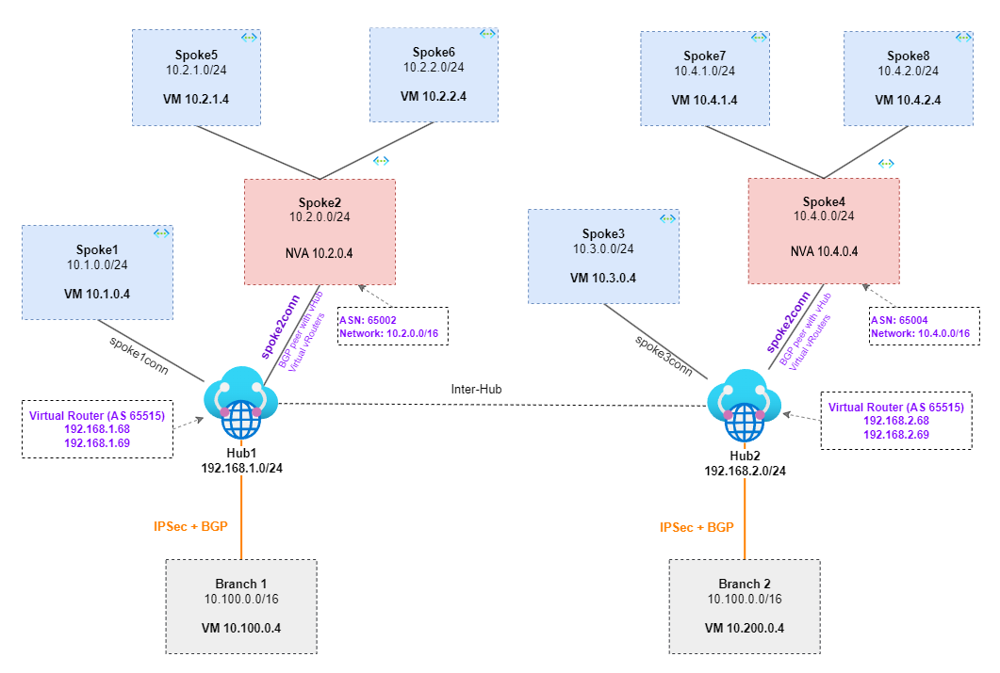

# Lab - Virtual WAN Scenario: Route traffic through an NVA spoke using BGP peering

## Intro

PLEASE NOTE: This a BICEP template based on Daniel Mauser's lab which can be found here - https://github.com/dmauser/azure-virtualwan/blob/main/inter-region-nvabgp 

The main goal of this lab is to demonstrate and validate the Azure Virtual WAN scenario to route traffic through an NVA (using a Linux VM NVA). The scenario is the same published by the vWAN official document [Scenario: Route traffic through an NVA](https://docs.microsoft.com/en-us/azure/virtual-wan/scenario-route-through-nva) but using BGP instead of vWAN static routes over Hub route table and connections. Additional reference for BGP peering can also be found in [Scenario: BGP peering with a virtual hub](https://docs.microsoft.com/en-us/azure/virtual-wan/scenario-bgp-peering-hub).

### Lab diagram

The lab uses the same amount of VNETs (eight total) described on the official documentation, two regions with Hubs, and remote connectivity to two branches using site-to-site VPN (IPSEC + BGP). Below is a diagram of what you should expect to get deployed:

### Components

- Two Virtual WAN Hubs in two different regions (you can change the regions over the script under the parameters section).
- Eight VNETs (Spoke 1 to 8) where:
    - Four VNETs (spoke 1, 2, 3, and 4) are connected directly to their respective vHUBs.
    - The other four (indirect spokes) spoke 5, 6, 7, and 8 peered with their respective Spokes (2 and 4) where we have the Linux NVAs.
- There are UDRs associated with the indirect spoke VNETs 5, 6, 7, 8 with default route 0/0 to their respective Transit NVA spoke.
- Virtual WAN hubs have BGP peerings to their respective Linux NVAs spokes. Each NVA advertises the networks 10.2.1.0/24 10.2.2.0/24 8.8.8.0/24 (Spoke2 Linux NVAs) and 10.4.1.0/24 10.4.2.0/24 9.9.9.0/24  (Spoke 4 Linux NVAs).
- Transit is allowed from indirect spokes to Spoke2 and Spoke4 using their Linux NVAs.
- Each Linux NVA has a single network interface with IP forwarding enabled, BGP (FRRouting - FRR) and NAT are configured two allow transit between Indirect Spokes to the other spokes connected to vHUB as well as Internet breakout is possible (only from indirect spoke VMs).
- There are two Branch locations (Branch1 - 10.100.0.0/16 and Branch2 - 10.200.0.0/16) each one connected to their respective vHUBs using S2S IPSec VPN + BGP (Branch 1 using ASN 65010 and Branch 2 using ASN 65009).
- Each VNET has a Windows VM accessible from RDP (need to adjust NSG to allow access).
- The outcome of the lab will be full transit between all ends (all VMs can reach each other).
